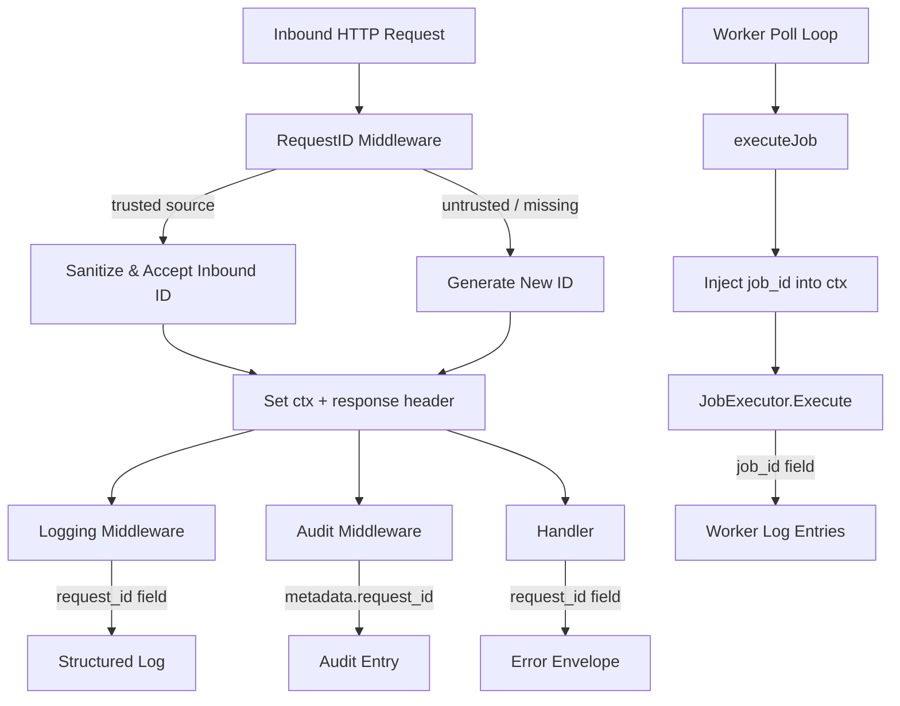

# Design Document: Request ID Propagation

## Overview

This design consolidates and extends request/job ID handling across the stellarbill-backend. The current codebase has two competing HTTP middleware implementations (`middleware.RequestID()` in `middleware.go` and `middleware.RequestLogger()` in `logger.go`) that each generate IDs independently. This creates ambiguity about which ID is canonical and means some log lines carry a UUID while others carry a 24-hex string.

The design introduces:
- A single canonical `RequestID` middleware with trusted-source allowlisting
- A shared `requestid` package exposing context helpers used by HTTP and worker layers
- Propagation of `request_id` into audit entries and structured log fields
- A `job_id` context key for the worker layer

## Architecture



The key architectural decision is to introduce a small `internal/requestid` package that owns:
1. The canonical context key constants
2. `FromContext` / `WithRequestID` / `WithJobID` helpers
3. The `Sanitize` function (moved from `middleware.go`)
4. The `Generate` function

All other packages import from `internal/requestid` rather than defining their own keys or generators.

## Components and Interfaces

### `internal/requestid` package

```go
package requestid

import (
    "context"
    "crypto/rand"
    "encoding/hex"
    "net"
    "strings"
    "time"
)

const (
    // ContextKey is the key used in context.Context and gin.Context.
    ContextKey = "request_id"
    // HeaderName is the canonical inbound/outbound HTTP header.
    HeaderName = "X-Request-ID"
    // JobIDKey is the key used in context.Context for background jobs.
    JobIDKey = "job_id"
    // WorkerIDKey is the key used in context.Context for the worker identity.
    WorkerIDKey = "worker_id"
)

// requestIDCtxKey is an unexported type to avoid collisions with other packages.
type requestIDCtxKey struct{}
type jobIDCtxKey struct{}
type workerIDCtxKey struct{}

// Generate returns a cryptographically random 24-hex-character ID.
func Generate() string { ... }

// Sanitize validates an inbound ID value. Returns ("", false) if invalid.
func Sanitize(value string) (string, bool) { ... }

// IsTrustedSource returns true if remoteAddr falls within one of the provided CIDR ranges.
func IsTrustedSource(remoteAddr string, allowlist []net.IPNet) bool { ... }

// WithRequestID returns a context carrying the given request ID.
func WithRequestID(ctx context.Context, id string) context.Context { ... }

// FromContext extracts the request ID from ctx. Returns ("", false) if absent.
func FromContext(ctx context.Context) (string, bool) { ... }

// WithJobID returns a context carrying the given job ID.
func WithJobID(ctx context.Context, id string) context.Context { ... }

// JobIDFromContext extracts the job ID from ctx.
func JobIDFromContext(ctx context.Context) (string, bool) { ... }

// WithWorkerID returns a context carrying the worker ID.
func WithWorkerID(ctx context.Context, id string) context.Context { ... }

// WorkerIDFromContext extracts the worker ID from ctx.
func WorkerIDFromContext(ctx context.Context) (string, bool) { ... }
```

### Updated `internal/middleware/middleware.go`

`RequestID()` is replaced by `RequestIDWithConfig(cfg RequestIDConfig)`:

```go
type RequestIDConfig struct {
    // TrustedProxies is the parsed allowlist from config.
    TrustedProxies []net.IPNet
}

func RequestIDWithConfig(cfg RequestIDConfig) gin.HandlerFunc
```

The old `RequestID()` function is kept as a zero-config shim calling `RequestIDWithConfig(RequestIDConfig{})` for backward compatibility during the transition, then removed once all call sites are updated.

`middleware.RequestLogger()` in `logger.go` is removed. Its structured logging responsibility moves to the updated `Logging()` middleware which reads the ID from context rather than generating it.

### Updated `internal/audit/middleware.go`

`LogAction` is updated to extract `request_id` from the Gin context and inject it into the metadata map before calling `logger.Log`.

`audit.Logger.Log` gains a helper `withRequestID(ctx context.Context, meta map[string]string) map[string]string` that reads `requestid.FromContext(ctx)` and merges it into metadata.

### Updated `internal/worker/worker.go`

`executeJob` is updated to call `requestid.WithJobID(ctx, job.ID)` and `requestid.WithWorkerID(ctx, w.config.WorkerID)` before passing the context to `executor.Execute`. All `zap.String("job_id", ...)` calls are replaced with a helper that reads from context.

### Updated `internal/config/config.go`

A new field is added:

```go
type Config struct {
    // ... existing fields ...
    RequestIDTrustedProxies []net.IPNet
}
```

Parsed from `REQUEST_ID_TRUSTED_PROXIES` (comma-separated CIDR list).

## Data Models

### Context Keys

| Key constant | Package | Value string | Used by |
|---|---|---|---|
| `requestid.ContextKey` | `internal/requestid` | `"request_id"` | HTTP middleware, audit, handlers |
| `requestid.JobIDKey` | `internal/requestid` | `"job_id"` | Worker |
| `requestid.WorkerIDKey` | `internal/requestid` | `"worker_id"` | Worker |

### Config Fields

```go
// REQUEST_ID_TRUSTED_PROXIES=10.0.0.0/8,172.16.0.0/12
RequestIDTrustedProxies []net.IPNet
```

### Audit Entry Metadata (extended)

```json
{
  "ts": "...",
  "actor": "...",
  "action": "...",
  "metadata": {
    "request_id": "a3f9c2e1b4d07f8a1c2e",
    "path": "/api/v1/subscriptions",
    "method": "POST"
  }
}
```

### Error Envelope (standardised)

```json
{
  "error": "unauthorized",
  "request_id": "a3f9c2e1b4d07f8a1c2e"
}
```

## Correctness Properties

*A property is a characteristic or behavior that should hold true across all valid executions of a system — essentially, a formal statement about what the system should do. Properties serve as the bridge between human-readable specifications and machine-verifiable correctness guarantees.*

---

Property 1: Sanitizer accepts valid IDs unchanged
*For any* string composed entirely of ASCII alphanumeric characters and `-`, `_`, `.` with length between 1 and 128, `Sanitize` SHALL return the original string and `true`.
**Validates: Requirements 2.1, 2.5**

---

Property 2: Sanitizer rejects invalid IDs
*For any* string that contains a character outside `[a-zA-Z0-9\-_.]`, or whose length is 0 or exceeds 128, `Sanitize` SHALL return `("", false)`.
**Validates: Requirements 2.1, 2.2, 2.3**

---

Property 3: Generated IDs are always valid
*For any* call to `Generate()`, the returned string SHALL pass `Sanitize` with result `true`, and SHALL have length exactly 24.
**Validates: Requirements 1.2**

---

Property 4: Trusted-source acceptance round-trip
*For any* valid sanitized inbound ID and a remote IP that matches the Allowlist, the middleware SHALL set the Gin context `request_id` to that exact inbound value.
**Validates: Requirements 1.3, 3.3, 3.4**

---

Property 5: Untrusted-source ID is always replaced
*For any* inbound `X-Request-ID` value and a remote IP that does not match the Allowlist, the middleware SHALL set the Gin context `request_id` to a freshly generated value that is different from the inbound value.
**Validates: Requirements 1.4, 3.5**

---

Property 6: Response header echoes context ID
*For any* request processed by the middleware, the `X-Request-ID` response header value SHALL equal the `request_id` stored in the Gin context.
**Validates: Requirements 1.5**

---

Property 7: Audit entries carry request_id
*For any* audit entry written during an HTTP request that has a `request_id` in its context, the entry's `metadata` map SHALL contain the key `"request_id"` with the same value.
**Validates: Requirements 5.1, 5.2**

---

Property 8: Worker context carries job_id
*For any* job dispatched by the worker, the `context.Context` passed to `JobExecutor.Execute` SHALL contain the job's `ID` under `requestid.JobIDKey`.
**Validates: Requirements 7.2, 7.3**

---

Property 9: Empty allowlist always generates new ID
*For any* request with any inbound `X-Request-ID` value, when the Allowlist is empty, the middleware SHALL always generate a new ID (never use the inbound value).
**Validates: Requirements 3.2**

---

Property 10: IsTrustedSource CIDR matching is consistent
*For any* IP address and CIDR range, `IsTrustedSource` SHALL return `true` if and only if the IP falls within the CIDR, consistent with `net.IPNet.Contains`.
**Validates: Requirements 3.3**

## Error Handling

| Scenario | Behaviour |
|---|---|
| `crypto/rand` failure in `Generate()` | Fall back to `hex(time.Now().UnixNano())` — same as current implementation |
| Invalid CIDR in `REQUEST_ID_TRUSTED_PROXIES` | Log warning, skip entry, continue startup |
| Inbound ID fails sanitization | Treat as absent; generate new ID; optionally log at DEBUG |
| `request_id` absent from context in audit | Omit `"request_id"` key from metadata; do not write empty string |
| `request_id` absent from context in error handler | Write `""` as fallback to keep envelope shape consistent |

## Testing Strategy

### Unit Tests

- `requestid.Sanitize`: table-driven tests covering valid chars, boundary lengths (1, 128, 129), empty string, whitespace-only, special chars.
- `requestid.Generate`: verify length == 24, all hex chars, uniqueness across N calls.
- `requestid.IsTrustedSource`: table-driven tests for IP-in-CIDR, IP-outside-CIDR, IPv6, malformed remote addr.
- `RequestIDWithConfig` middleware: httptest-based tests for trusted/untrusted paths, missing header, malformed header.
- Audit `LogAction`: verify `request_id` appears in metadata when context carries one; verify omission when absent.
- Worker `executeJob`: verify context passed to executor contains `job_id` and `worker_id`.

### Property-Based Tests

Use `pgregory.net/rapid` (already available in Go ecosystem, zero external deps beyond `go get`).

Each property test runs a minimum of 100 iterations.

- **Property 1 & 2**: Generate random strings; classify as valid/invalid; assert `Sanitize` result matches classification.
  - Tag: `Feature: request-id-propagation, Property 1+2: sanitizer accepts valid / rejects invalid`
- **Property 3**: Call `Generate()` 100+ times; assert each result passes `Sanitize` and has length 24.
  - Tag: `Feature: request-id-propagation, Property 3: generated IDs are always valid`
- **Property 4 & 5**: Generate random valid IDs and random IPs; assert trusted/untrusted routing.
  - Tag: `Feature: request-id-propagation, Property 4+5: trusted-source routing`
- **Property 6**: Fuzz middleware with random headers; assert response header == context value.
  - Tag: `Feature: request-id-propagation, Property 6: response header echoes context`
- **Property 7**: Generate random audit actions with random request IDs in context; assert metadata.
  - Tag: `Feature: request-id-propagation, Property 7: audit entries carry request_id`
- **Property 8**: Generate random jobs; assert executor context contains job_id.
  - Tag: `Feature: request-id-propagation, Property 8: worker context carries job_id`
- **Property 9**: Empty allowlist fuzz — any inbound ID is always replaced.
  - Tag: `Feature: request-id-propagation, Property 9: empty allowlist always generates`
- **Property 10**: CIDR matching consistency.
  - Tag: `Feature: request-id-propagation, Property 10: IsTrustedSource CIDR matching`
